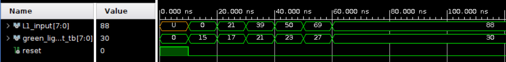
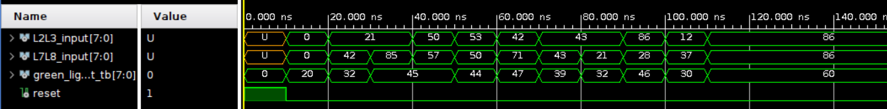
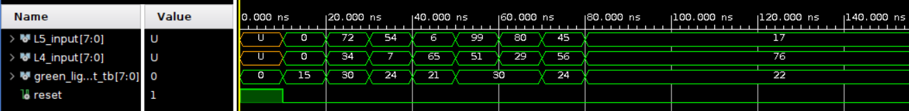
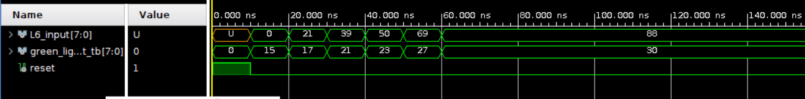
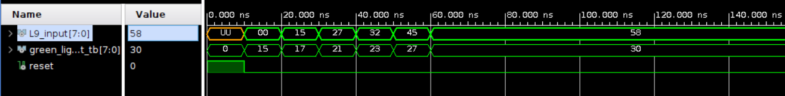
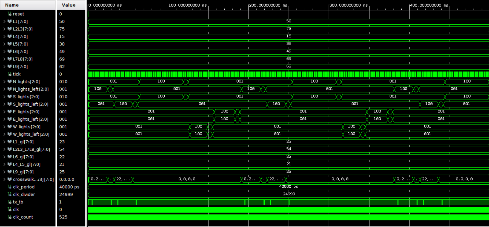
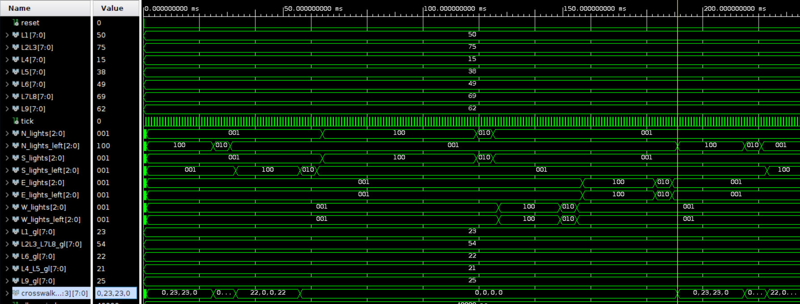
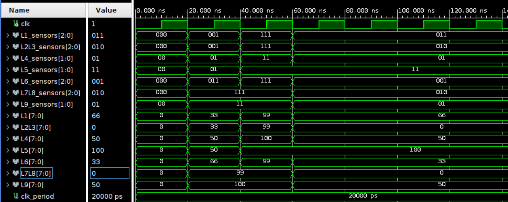

## Testbench Overview

This section contains the testbenches for verifying the functionality of each module within the **Traffic Light Fuzzy Logic Controller** project. Each testbench evaluates the behavior of its corresponding module under various input conditions to ensure accurate green light timings for traffic sequences.

### Note
The expected values in the test cases are estimates and may differ from the actual output.

### Testbenches Table of Contents
| Testbench                                  | Description                                                  |
|--------------------------------------------|--------------------------------------------------------------|
| [L1 Sequence Testbench](#l1-sequence-testbench) | Verifies the functionality of the L1 Sequence Controller     |
| [L2L3_L7L8 Sequence Testbench](#l2l3_l7l8-sequence-testbench) | Verifies the L2L3 and L7L8 Sequence Controller          |
| [L4_L5 Sequence Testbench](#l4_l5-sequence-testbench) | Verifies the functionality of the L4 and L5 Sequence Controller |
| [L6 Sequence Testbench](#l6-sequence-testbench) | Verifies the functionality of the L6 Sequence Controller     |
| [L9 Sequence Testbench](#l9-sequence-testbench) | Verifies the functionality of the L9 Sequence Controller     |
| [State Machine Testbench](#state-machine-testbench) | Verifies the overall state machine and sequence coordination |

---

## L1 Sequence Testbench
**File**: `L1_Sequence_Controller_TB.vhd`

### Overview
The **L1 Sequence Testbench** assesses the green light timing produced by the `L1_Sequence_Controller` module. It evaluates the fuzzy logic processing for lane `L1`, applying various input traffic levels to verify the output duration of the green light.

### Purpose
The purpose of this testbench is to validate that the `L1_Sequence_Controller` accurately translates different levels of traffic density on lane `L1` into appropriate green light durations. By simulating multiple traffic densities, the testbench ensures that fuzzy membership levels map correctly to the final output signal, which is the green light timing.

### Signals
- **L1_input**: Represents the simulated traffic density on lane `L1`.
- **green_light_output_tb**: The output signal showing the duration of the green light based on `L1` traffic.
- **reset**: Initializes the system and brings it to a default state before tests begin.

### Test Cases
1. **Reset Initialization**: Applies reset to confirm proper initialization.
2. **Low Traffic Input**: Tests minimal values for `L1` and checks if the output is a short green duration.
3. **Medium Traffic Input**: Tests mid-range values for `L1` to confirm output scaling.
4. **High Traffic Input**: Tests higher values of `L1` and expects the longest green light duration.

### Testbench Simulation
The following image demonstrates the results of the `L1` sequence testbench simulation:

---

## L2L3_L7L8 Sequence Testbench
**File**: `L2L3_L7L8_Sequence_Controller_TB.vhd`

### Overview
The **L2L3_L7L8 Sequence Testbench** evaluates the `L2L3_L7L8_Sequence_Controller` module, which processes traffic densities from both `L2L3` and `L7L8` lanes. This testbench ensures that green light durations reflect accurate calculations based on the combined inputs from both lanes.

### Purpose
This testbench confirms that the module properly handles the combined traffic data from lanes `L2L3` and `L7L8` to produce an optimized green light output. By providing various combinations of densities, it verifies that the fuzzy logic outputs a balanced green light duration reflecting both lanes.

### Signals
- **L2L3_input** and **L7L8_input**: Represent simulated traffic densities on lanes `L2L3` and `L7L8`, respectively.
- **green_light_output_tb**: Final green light duration determined by the combined effect of `L2L3` and `L7L8`.
- **reset**: Initializes and resets the controller for each test.

### Test Cases
1. **Reset Check**: Applies reset to establish a clean state.
2. **Low Combined Input**: Tests both `L2L3` and `L7L8` with minimal values.
3. **High Traffic in `L7L8`, Low in `L2L3`**: Tests a mixed traffic scenario to confirm proper output adjustment.
4. **High Traffic Input for Both**: Simulates heavy traffic for both lanes to observe the longest green duration.

### Testbench Simulation

---

## L4_L5 Sequence Testbench
**File**: `L4_L5_Sequence_Controller_TB.vhd`

### Overview
The **L4_L5 Sequence Testbench** focuses on the `L4_L5_Sequence_Controller` module, evaluating green light durations generated by fuzzy logic based on traffic inputs from `L4` and `L5`.

### Purpose
This testbench checks if the controller for lanes `L4` and `L5` can adaptively adjust green light durations depending on variable traffic densities. It confirms that different input levels on both lanes result in appropriate green light timings.

### Signals
- **L4_input** and **L5_input**: Represent traffic levels on lanes `L4` and `L5`.
- **green_light_output_tb**: Output signal indicating the computed green light duration.
- **reset**: Used to initialize and clear the module state.

### Test Cases
1. **System Reset**: Applies reset to start the test in a known state.
2. **Balanced Traffic**: Tests moderate values on both `L4` and `L5`.
3. **Heavy Traffic in `L5`, Low in `L4`**: Validates if high traffic in `L5` increases green light time while accounting for `L4`.
4. **Heavy Traffic on Both**: Simulates maximum density for both lanes and observes output.

### Testbench Simulation

---

## L6 Sequence Testbench
**File**: `L6_Sequence_Controller_TB.vhd`

### Overview
The **L6 Sequence Testbench** tests the `L6_Sequence_Controller`, responsible for computing green light durations based solely on traffic in `L6`.

### Purpose
The purpose is to ensure that the `L6_Sequence_Controller` module responds correctly to changes in `L6` traffic levels by adjusting the green light timing. It verifies whether low, medium, and high traffic levels are mapped to suitable output durations.

### Signals
- **L6_input**: Simulated traffic density input for lane `L6`.
- **green_light_output_tb**: Output signal reflecting the green light duration based on `L6`.
- **reset**: Clears the system state.

### Test Cases
1. **Initial Reset**: Checks if reset brings the controller to a default state.
2. **Low Traffic**: Applies a low density to `L6`.
3. **Moderate Traffic**: Tests mid-range density levels for green light adjustment.
4. **High Traffic**: Simulates heavy traffic, expecting a longer green light time.

### Testbench Simulation

---

## L9 Sequence Testbench
**File**: `L9_Sequence_Controller_TB.vhd`

### Overview
The **L9 Sequence Testbench** verifies the functionality of `L9_Sequence_Controller` by applying various traffic levels to lane `L9` and examining the resulting green light output.

### Purpose
This testbench validates that the `L9_Sequence_Controller` can dynamically adjust green light timings in response to changing traffic conditions on `L9`, confirming that fuzzy logic is accurately applied.

### Signals
- **L9_input**: Input signal representing `L9` traffic density.
- **green_light_output_tb**: Computed green light output based on `L9` density.
- **reset**: Resets the controller state.

### Test Cases
1. **Reset Functionality**: Confirms reset effectiveness.
2. **Low Density Traffic**: Applies minimal traffic to `L9`.
3. **Intermediate Density**: Applies mid-level traffic and checks the output.
4. **High Density Traffic**: Simulates heavy congestion to verify maximum green duration.

### Testbench Simulation

---

## State Machine Testbench
**File**: `Sequence_State_Machine_TB.vhd`

### Overview
The **State Machine Testbench** evaluates the `Sequence_State_Machine`, which coordinates all traffic light sequences and synchronizes them with crosswalk timers. This testbench verifies the transitions between each sequence state, ensuring that each traffic light and crosswalk timer is controlled as expected based on simulated traffic conditions.

### Purpose
The primary purpose of this testbench is to validate the `Sequence_State_Machine`'s ability to dynamically transition between different traffic light sequences, handle crosswalk signals, and ensure all components operate cohesively. The state machine is responsible for moving through the defined sequences (e.g., `L1_state`, `L6_state`, etc.), handling transitions to yellow and red lights before moving to the next sequence. Additionally, it monitors crosswalk timer activations and aligns them with each traffic sequence, ensuring pedestrian timing integrates smoothly with traffic lights.

### Signals
- **Traffic Inputs**: Signals like `L1`, `L2L3`, `L4`, `L5`, `L6`, `L7L8`, and `L9` represent simulated traffic densities for each lane.
- **Crosswalk Buttons**: Signals such as `L8L7_b_left`, `L8L7_b_right`, etc., simulate pedestrian button presses for crosswalk activation.
- **Light Outputs**: `N_lights`, `S_lights`, `E_lights`, and `W_lights` represent the 3-bit outputs controlling the green, yellow, and red states for each direction.
- **Tick Signal**: An internal tick that advances the state machine based on real-time clock cycles, simulating 1-second intervals for sequence progression.
- **Crosswalk Timer Bytes**: A 4-byte array representing crosswalk timers, where each byte corresponds to a specific side of the intersection. These bytes update with each sequence, ensuring pedestrian crossing times are synchronized with the light sequences.

### Test Cases
1. **System Reset**: Initializes the state machine to the idle state, resetting counters and timers.
2. **Traffic Pattern Simulations**: Tests varying traffic levels on each lane input, ensuring that sequences adapt to traffic density and crosswalk signals.
3. **Crosswalk Timer Transitions**: Monitors crosswalk timers as they transition alongside sequence states, ensuring pedestrian crossing times are synchronized with traffic lights.
4. **Tick Progression**: Simulates the passage of real-time seconds, verifying that the state machine advances correctly through each sequence and applies the appropriate yellow and red states.

### Testbench Simulation
The testbench includes two simulation images for comprehensive analysis:

1. **General Simulation for 500 Seconds**: This simulation spans 500 seconds, showing numerous sequence changes, crosswalk timings, and 500 ticks in total. The output illustrates how the state machine cycles through each sequence, coordinating light transitions and crosswalk updates in real-time. This overview verifies the stability of the state machine over an extended period, confirming the correct handling of transitions and time intervals.

   

2. **Zoomed-In Simulation for Sequence Transitions**: This image provides a close-up view of the state machine's behavior across five consecutive sequences. It captures the detailed transition process, showing each traffic light and crosswalk timer update in sync with sequence changes. By examining this zoomed-in segment, we can observe the precise timing of light transitions from green to yellow and then to red before the next sequence activates. The crosswalk timers also adjust with each sequence, demonstrating accurate alignment between pedestrian signals and traffic flow.

   

This testbench confirms that the **Sequence_State_Machine** operates as intended, seamlessly managing traffic light sequences, crosswalk timers, and state transitions. Through extensive testing across multiple scenarios and sequence changes, the state machine demonstrates reliable functionality for adaptive traffic control.

---

## Input Scalar Testbench

**File**: `Input_Scalar_TB.vhd`

### Overview
The **Input Scalar Testbench** verifies the functionality of the `Input_Scalar` module, which is responsible for scaling raw sensor inputs into values on a 0-100 scale. The output represents the traffic density as a percentage, aligning with the fuzzy logic system’s universe of discourse.

### Purpose
The testbench aims to confirm that the `Input_Scalar` module accurately converts the sensor inputs from each lane into traffic density percentages based on the number of active sensors. This is essential for providing appropriately scaled inputs to the fuzzy logic system, as it relies on a standardized 0-100 range.

### Signals
- **clk**: System clock signal.
- **L1_sensors** through **L9_sensors**: Input signals representing the raw sensor values for lanes L1, L2L3, L4, L5, L6, L7L8, and L9.
- **L1** through **L9**: Scaled 8-bit output signals representing traffic density on a 0-100 scale.

### Test Cases
1. **All Sensors Off**: Tests the module with no active sensors, expecting minimum output values.
2. **Partial Sensors On**: Applies various sensor values to observe intermediate density levels.
3. **Max Sensors Active**: Tests with maximum sensors active on each lane to confirm correct 100% scaling.
4. **Random Sensor Combinations**: Simulates mixed input patterns to ensure accurate scaling across varied inputs.

### Testbench Simulation
The following image illustrates the results of the Input Scalar testbench simulation:

---

Each testbench validates its respective module's operation within the traffic light system, providing reliable tests for real-time traffic control.
