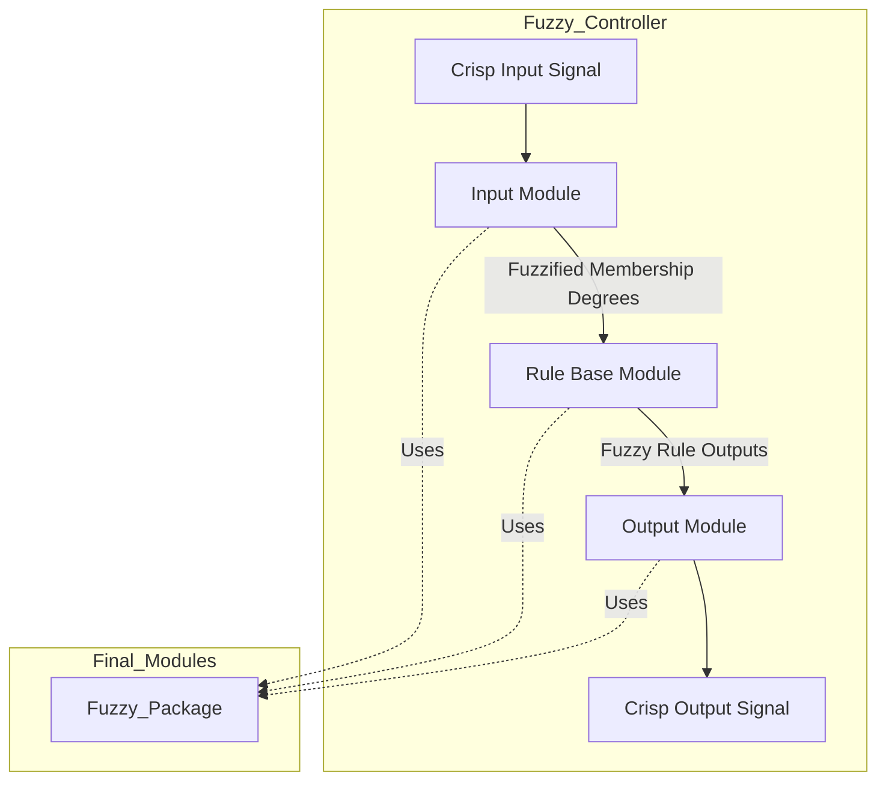

# VHDL Fuzzy Logic System

This repository contains a complete VHDL-based fuzzy logic system that is modular and designed for easy integration into various control systems, such as temperature control, tipping systems, and other decision-making applications. The repository is organized into two main subfolders: **Final_Modules** and **Test_Files**. Each folder contains VHDL files that are designed for different stages of fuzzy logic system development and testing.

## Subfolders Overview

### Final_Modules
The `Final_Modules` folder contains the main building blocks for the fuzzy logic system. These modules are reusable and designed to handle various fuzzy logic processes, such as input fuzzification, rule evaluation, and output defuzzification. These files are the core of the system and can be implemented in various projects without requiring modification (except for the `Fuzzy_Controller` module, which may need to be adjusted to fit your specific design). 

### Test_Files
The `Test_Files` folder includes testbenches for each of the modules found in the `Final_Modules` folder. These testbenches are designed to verify the functionality of each module by simulating different inputs and checking the output results. The tests ensure that the system works as expected under different conditions. Each testbench is configured for specific modules and provides a good foundation for verifying the entire fuzzy logic system before deployment.

## How It Works

The fuzzy logic system is composed of three main stages: **fuzzification**, **rule evaluation**, and **defuzzification**. Each stage is managed by a separate module that processes inputs, applies fuzzy logic rules, and generates a single, actionable output. This section provides a deep dive into the calculations, data structures, and interactions within each stage.

---

### 1. Fuzzification (Input Module)

The **fuzzification** stage begins in the **input module** (`input.vhd`). This module's role is to convert a crisp input (e.g., temperature, speed) into fuzzy membership degrees for predefined fuzzy sets (e.g., "low," "medium," "high").

#### Membership Functions and Scaling Factor
Each fuzzy set is described by a **membership function**, defined by:
- **point1 and point2**: These are the start and end points of the fuzzy set, controlling where the fuzzy degree transitions between zero and full membership.
- **slope1 and slope2**: These slopes define the rate at which the membership degree increases (from `point1` to peak) and decreases (from peak to `point2`).

To allow accurate handling of fractional slopes, a **scaling factor** (default 100) is applied. This scaling factor lets the system represent slopes like 0.25 or 0.5 as integers by multiplying by 100 (e.g., 0.25 becomes 25). Users should multiply slope values by the scaling factor to maintain the desired precision.

#### Membership Degree Calculation
The **Membership_Fuzzification** function calculates the membership degrees for each fuzzy set based on the crisp input. Below is a breakdown of how this calculation works:

1. **If the Crisp Input is Before point1**:
   - The input is completely outside the fuzzy set, so the membership degree is set to 0.

2. **If the Input is Between point1 and point2 (Rising Slope)**:
   - The membership degree is calculated based on the rise slope (`slope1`).
     membership_degree = (input - point1) * slope1
   - The result is then divided by the scaling factor:
     membership_degree = calculated_degree / scaling_factor

3. **If the Input is at point2**:
   - The degree reaches its peak, so the membership degree is set to 255.

4. **If the Input is Beyond point2 (Falling Slope)**:
   - The degree decreases based on the fall slope (`slope2`), calculated as:
     membership_degree = 255 - ((input - point2) * slope2)
   - This result is then divided by the scaling factor to yield the final membership degree.

The `Membership_Fuzzification` function loops through each fuzzy set, performing these calculations and creating a vector of membership degrees, with each element representing the degree of membership for one fuzzy set.

#### Handling Multiple Inputs
When there are multiple inputs (e.g., taste, service), each input is fuzzified independently. The results are then **concatenated** to form a combined vector of membership degrees (`mf_degrees_all`), where each input has its own section in the combined vector. For example, if `taste` has two membership degrees and `service` has two as well, `mf_degrees_all` would be:

mf_degrees_all = [taste_low, taste_high, service_poor, service_excellent]

This concatenation allows the rule base to evaluate all membership degrees in a unified way.

---

### 2. Rule Evaluation (Rule Base Module)

The **rule evaluation** stage happens in the **rule base module** (`rule_base.vhd`). This module uses the membership degrees from the input module, applies fuzzy logic rules, and determines the fuzzy degrees for the output sets.

#### Rule Structure and Matrix Representation
The rule base is highly flexible, using vectors and matrices to store the rules. Here’s how it works:

1. **Rule Type Array (rule_type_array)**:
   - This vector defines the logic operation for each rule: AND (`0`) or OR (`1`).
   - For instance, `rule_type_array = [0, 0, 1, 1]` means that the first two rules use AND logic, while the last two use OR logic.

2. **Rule Conditions Matrix (rule_conditions_array)**:
   - This matrix specifies which membership degrees each rule considers. Each row represents a rule, and each column corresponds to a fuzzy set in `mf_degrees_all`.
   - For example, suppose `rule_conditions_array` is:
     ```
     [
       [1, 0, 1, 0],
       [0, 1, 1, 0],
       [1, 0, 0, 1],
       [0, 1, 0, 1]
     ]
     ```
   - This matrix would mean:
     - **Rule 1**: Applies to `taste_low` AND `service_poor`.
     - **Rule 2**: Applies to `taste_high` AND `service_poor`.
     - **Rule 3**: Applies to `taste_low` AND `service_excellent`.
     - **Rule 4**: Applies to `taste_high` AND `service_excellent`.

3. **Output Notation Array (output_notation)**:
   - This array assigns each rule to an output fuzzy set. For example, `output_notation = [1, 2, 2, 3]` might mean:
     - Rule 1 maps to the "low" output fuzzy set.
     - Rules 2 and 3 both map to "medium."
     - Rule 4 maps to "high."

#### Conjunction (AND) and Disjunction (OR) Operations
Each rule combines multiple inputs using AND or OR, determined by `rule_type_array`:

- **AND (Conjunction)**: The **conjunction** function computes the minimum degree among the inputs:
  conjunction_result = min(membership_degrees)
  - This approach reflects the "weakest link," where a low degree in one input reduces the overall membership degree.

- **OR (Disjunction)**: The **disjunction** function computes the maximum degree:
  disjunction_result = max(membership_degrees)
  - This represents the "strongest link," where a high degree in any input elevates the membership degree.

The rule base module iterates through each rule, checks the relevant inputs based on `rule_conditions_array`, applies the AND/OR logic based on `rule_type_array`, and stores the result in rule_output.

#### Finalizing Output Degrees
When multiple rules affect the same output fuzzy set (e.g., both Rules 2 and 3 map to "medium"), the results are combined using disjunction (OR logic) to yield a final fuzzy degree for each output set. This is stored in combined_outputs. For instance:

combined_outputs = [low, max(medium1, medium2), high]

---

### 3. Defuzzification (Output Module)

In the **defuzzification** stage, the **output module** (`output.vhd`) converts the fuzzy degrees from `combined_outputs` into a single crisp output, like a specific fan speed or heater level.

#### Centroid Calculation (Weighted Average)
The **Defuzzification** function converts fuzzy degrees into a crisp output using the centroid method. Here’s a breakdown of the calculation:

1. **Weighted Sum of Fuzzy Degrees and Singletons**:
   - For each fuzzy set, multiply its degree by its singleton value (e.g., 10 for "low," 50 for "medium," 90 for "high"):
     weighted_sum = sum(membership_degree * singleton_value)
   - If "medium" has two contributions (e.g., from Rules 2 and 3), it’s combined via disjunction before this calculation.

2. **Sum of Degrees**:
   - Sum all membership degrees for the output fuzzy sets:
     sum_of_degrees = sum(membership_degrees)

3. **Crisp Output Calculation**:
   - Divide the weighted sum by the sum of degrees to get the centroid:
     crisp_output = weighted_sum / sum_of_degrees
   - This yields a crisp value within the control range, balancing the fuzzy degrees.

The defuzzified output becomes the system’s final output, ready for use in control applications.

---

### Overall Workflow Diagram
Here is a diagram that explains how the modules are connected and how data flows through the system:



## Installation and Usage

### Installation

All the final modules must be implemented in a VHDL project using **Xilinx Vivado**. These modules are meant to function together without requiring modification, except for the `Fuzzy_Controller` module.

### Usage

- Only the `Fuzzy_Controller` module needs to be modified based on your design requirements. This is the module where you will integrate different inputs, define membership functions, and set the desired fuzzy logic behavior.
  
- The other modules in the `Final_Modules` folder—such as `input.vhd`, `output.vhd`, and `rule_base.vhd`—do not need to be edited. These modules are already designed to handle fuzzification, rule evaluation, and defuzzification processes, making them reusable across different projects.
  
- Once you modify the `Fuzzy_Controller` to fit your design needs, it will combine the fuzzified input, evaluate the rules, and produce a crisp output using the defuzzification process.

- After setting up the modules, you can run simulations using testbenches. 

- Refer to Test_Files/Tipping_Fuzzy folder for an example on how to use the modules all together.

By utilizing this system, you can implement fuzzy logic control in a variety of applications, with flexibility to adjust the input conditions, rule configurations, and outputs to meet your specific needs.

