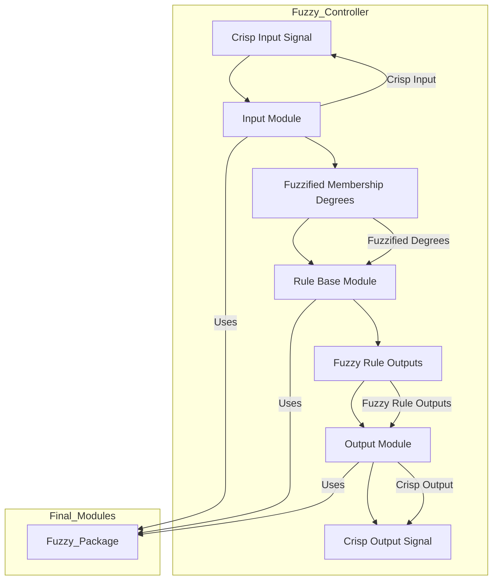

# VHDL Fuzzy Logic System

This repository contains a complete VHDL-based fuzzy logic system that is modular and designed for easy integration into various control systems, such as temperature control, tipping systems, and other decision-making applications. The repository is organized into two main subfolders: **Final_Modules** and **Test_Files**. Each folder contains VHDL files that are designed for different stages of fuzzy logic system development and testing.

## Subfolders Overview

### Final_Modules
The `Final_Modules` folder contains the main building blocks for the fuzzy logic system. These modules are reusable and designed to handle various fuzzy logic processes, such as input fuzzification, rule evaluation, and output defuzzification. These files are the core of the system and can be implemented in various projects without requiring modification (except for the `Fuzzy_Controller` module, which may need to be adjusted to fit your specific design). 

### Test_Files
The `Test_Files` folder includes testbenches for each of the modules found in the `Final_Modules` folder. These testbenches are designed to verify the functionality of each module by simulating different inputs and checking the output results. The tests ensure that the system works as expected under different conditions. Each testbench is configured for specific modules and provides a good foundation for verifying the entire fuzzy logic system before deployment.

## How It Works

The fuzzy logic system is divided into three main stages: **fuzzification**, **rule evaluation**, and **defuzzification**. Each of these stages is handled by a specific module, and they work together to process the input, apply fuzzy rules, and generate a crisp output.

### 1. Fuzzification (Input Module)
The first step in the fuzzy logic process is fuzzification. The input module (`input.vhd`) takes a crisp input signal (for example, a temperature reading) and converts it into fuzzy membership degrees based on predefined membership functions (such as "low," "medium," or "high"). These membership degrees represent the degree to which the input belongs to each fuzzy set.

### 2. Rule Evaluation (Rule Base Module)
Once the input has been fuzzified, the rule base module (`rule_base.vhd`) evaluates the fuzzified input values according to the fuzzy rules defined in the system. These rules can apply AND/OR logic (conjunction/disjunction) to multiple fuzzy sets. The rule base outputs fuzzy membership degrees for the output fuzzy sets (e.g., "low heat," "medium heat," "high heat").

### 3. Defuzzification (Output Module)
In the final step, the output module (`output.vhd`) takes the fuzzy membership degrees from the rule base and converts them into a single crisp output value through a process called defuzzification. This is typically done using the centroid (center of gravity) method, which computes a weighted average of the fuzzy degrees and their corresponding singleton values (crisp outputs).

### Overall Workflow Diagram
Here is a diagram that explains how the modules are connected and how data flows through the system:

## Installation and Usage

### Installation

All the final modules must be implemented in a VHDL project using **Xilinx Vivado**. These modules are meant to function together without requiring modification, except for the `Fuzzy_Controller` module.

### Usage

- Only the `Fuzzy_Controller` module needs to be modified based on your design requirements. This is the module where you will integrate different inputs, define membership functions, and set the desired fuzzy logic behavior.
  
- The other modules in the `Final_Modules` folder—such as `input.vhd`, `output.vhd`, and `rule_base.vhd`—do not need to be edited. These modules are already designed to handle fuzzification, rule evaluation, and defuzzification processes, making them reusable across different projects.
  
- Once you modify the `Fuzzy_Controller` to fit your design needs, it will combine the fuzzified input, evaluate the rules, and produce a crisp output using the defuzzification process.

- After setting up the modules, you can run simulations using testbenches. 

- Refer to Test_Files/Tipping_Fuzzy folder for an example on how to use the modules all together.

By utilizing this system, you can implement fuzzy logic control in a variety of applications, with flexibility to adjust the input conditions, rule configurations, and outputs to meet your specific needs.

