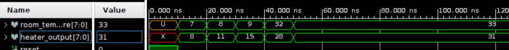

# Fuzzy Logic VHDL Testbenches

This repository contains the testbench files for verifying the functionality of various fuzzy logic modules in the VHDL-based fuzzy logic system. Each testbench is designed to simulate and verify the behavior of individual modules by applying a range of test cases and checking the output. These testbenches are intended to help ensure the correct operation of the fuzzy logic modules, including the input fuzzification, rule base, output defuzzification, and complete system controllers.

## Testbench Overview

- [Fuzzy_Controller Testbench](#fuzzy_controller-testbench)
- [Output Module Testbench](#output-module-testbench)
- [Rule Base Module Testbench](#rule-base-module-testbench)
- [Input Module Testbench](#input-module-testbench)
- [Tipping_Controller Testbench](#tipping_controller-testbench)

---

## Fuzzy_Controller Testbench

### File: `Fuzzy_Controller_tb.vhd`

### Overview
This testbench validates the functionality and integration of the fuzzy logic package by simulating control logic for a heating system based on room temperature. All the core functions and types from the fuzzy package are used within a single entity-architecture file, ensuring that the package operates correctly as a complete system. The testbench verifies that the fuzzy logic system can evaluate the room temperature and generate appropriate heater control signals using fuzzy rules.

### Purpose
The fuzzy controller is designed to maintain optimal room temperature by regulating the heater based on predefined fuzzy logic rules. The controller interprets temperature inputs in terms of Low, Medium, and High membership degrees and translates these into specific heating outputs. This initial testbench provides a foundation for testing the package’s reusable functions before more complex integration.

### Signals
- **room_temperature**: An 8-bit input signal that represents the simulated room temperature.
- **heater_output**: An 8-bit output signal used to control the heater based on the fuzzy evaluation.
- **reset**: A control signal used to initialize or reset the system state, ensuring consistent starting conditions for each test case.
- **clk**: A clock signal, primarily for synchronized operations and simulating real-time conditions.

### Internal Logic and Variables
1. **Temperature Membership Functions**: Defined for Low, Medium, and High temperatures, each using triangular and trapezoidal functions to model temperature regions.
   - **Low**: Covers temperatures from 0 to 50 degrees.
   - **Medium**: Spans 25 to 75 degrees, with a flat segment.
   - **High**: Represents temperatures from 50 to 100 degrees.

2. **Membership Degrees**: Each temperature range is assigned a fuzzy degree (Low, Medium, High), which represents the degree of membership for the input temperature.

3. **Rule Outputs**: Based on fuzzy logic rules that determine the heater’s output level.
   - **Low Temp** -> **High Heater Output**
   - **Medium Temp** -> **Medium Heater Output**
   - **High Temp** -> **Low Heater Output**

4. **Defuzzification**: Converts fuzzy rule outputs into a single crisp control signal for the heater.

### Test Cases
1. **Reset Condition**: Applies a reset signal to initialize the system, ensuring that all signals and memory states start from a known state.
2. **Temperature = 7 degrees**: Tests the controller’s behavior at a low temperature, expected to trigger a high heating output.
3. **Temperature = 8 degrees**: Evaluates the controller’s response at a slightly higher low temperature.
4. **Temperature = 9 degrees**: Tests the controller’s output as temperature remains within the low range.
5. **Temperature = 32 degrees**: Assesses the controller’s behavior when the temperature is in the medium range, expecting a medium heating output.
6. **Temperature = 33 degrees**: Verifies the response just above the medium threshold.

### Testbench Simulation

The following image shows the simulation results of the fuzzy controller testbench, illustrating how the system responds to various temperature inputs:

---

## Output Module Testbench

### File: `output_tb.vhd`

### Overview
The `output_tb` file tests the `output` module responsible for defuzzification, where fuzzy membership degrees are converted into a crisp value. This testbench applies predefined fuzzy membership degrees and singleton values and monitors the final crisp output.

### Signals:
- **output_mf_values_tb**: Fuzzy membership values for the output membership functions (Low, Medium, High).
- **singleton_values_tb**: Predefined singleton values representing the crisp values for each fuzzy output.
- **crisp_output_tb**: The resulting crisp output after defuzzification.

### Test Cases:
1. **Set fuzzy membership degrees**: Apply fuzzy membership values for Low, Medium, and High.
2. **Set singleton values**: Set singleton values on the universe of discourse for Low, Medium, and High.
3. **Monitor crisp output**: Monitor and report the final crisp output.

---

## Rule Base Module Testbench

### File: `tb_rule_base.vhd`

### Overview
The `tb_rule_base` file tests the `rule_base` module, which applies fuzzy logic rules based on input membership degrees and outputs fuzzy membership values for the output membership functions. The rules use AND or OR logic, depending on the configuration.

### Signals:
- **rule_type_array**: Defines whether each rule uses AND (0) or OR (1) logic.
- **rule_conditions_array**: Specifies the membership functions involved in each rule.
- **membership_degrees**: Input membership degrees.
- **rule_output**: Fuzzy membership degrees for each rule.
- **combined_outputs**: Final fuzzy membership values for the output membership functions.

### Test Cases:
1. **Reset condition**: Applies reset for system initialization.
2. **Rule conditions**: Defines rule conditions for input membership functions and sets input degrees.
3. **Monitor rule outputs**: Check the outputs from each rule and combined outputs for the final result.

---

## Input Module Testbench

### File: `input_tb.vhd`

### Overview
The `input_tb` file tests the `input` module responsible for fuzzifying a crisp input value into fuzzy membership degrees. The module is tested with various crisp input values and different membership functions defined by points and slopes.

### Signals:
- **crisp_input_tb**: Input value to be fuzzified.
- **membership_degrees_tb**: Fuzzified membership degrees.

### Test Cases:
1. **Reset condition**: Applies a reset signal to initialize the module.
2. **Test various crisp inputs**:
    - Apply crisp input values at various points along the membership functions (e.g., rising edges, peaks, and falling edges).
    - Crisp inputs such as 7, 15, 25, and 33 are tested to observe the behavior of each membership function.

---

## Tipping_Controller Testbench

### File: `Tipping_Controller_tb.vhd`

### Overview
The `Tipping_Controller_tb` file tests the `Tipping_Controller` module, which evaluates two inputs (`taste` and `service`) and outputs a tip amount based on fuzzy logic rules. This testbench simulates a tipping scenario where taste and service scores are evaluated, and the corresponding tip amount is calculated.

### Signals:
- **taste_input**: Input signal representing the quality of the taste.
- **service_input**: Input signal representing the quality of the service.
- **tip_output**: Output signal representing the calculated tip.
- **reset**: A reset signal to initialize the controller.

### Test Cases:
1. **Reset condition**: Applies reset to initialize the system.
2. **Taste = 0, Service = 0**: Tests the controller's response with the lowest possible scores.
3. **Taste = 145, Service = 145**: Tests with average scores for both taste and service.
4. **Taste = 55, Service = 200**: Tests with a low taste score and a high service score.
5. **Taste = 200, Service = 182**: Tests with a high taste score and an average service score.
6. **Taste = 200, Service = 200**: Tests with high taste score and a high service score.

---

## Conclusion

Each testbench file in this repository is designed to verify the correctness of individual fuzzy logic modules. The test cases applied in each file ensure that the system behaves as expected under various conditions and inputs. These testbenches can be expanded and modified to accommodate different use cases and fuzzy logic rules for more complex systems.

