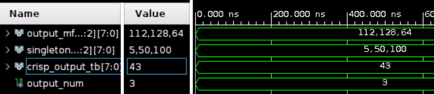
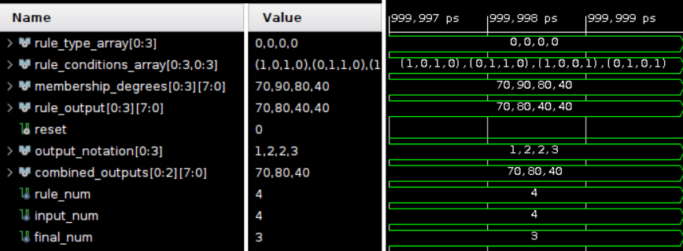
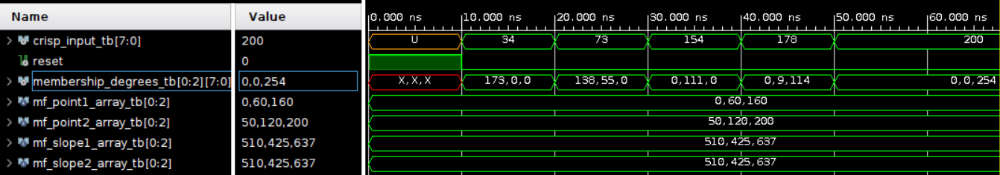
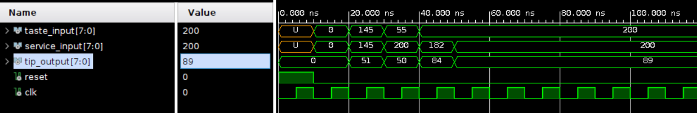

# Fuzzy Logic VHDL Testbenches

This repository contains the testbench files for verifying the functionality of various fuzzy logic modules in the VHDL-based fuzzy logic system. Each testbench is designed to simulate and verify the behavior of individual modules by applying a range of test cases and checking the output. These testbenches are intended to help ensure the correct operation of the fuzzy logic modules, including the input fuzzification, rule base, output defuzzification, and complete system controllers.

## Testbench Overview

- [Fuzzy_Controller Testbench](#fuzzy_controller-testbench)
- [Output Module Testbench](#output-module-testbench)
- [Rule Base Module Testbench](#rule-base-module-testbench)
- [Input Module Testbench](#input-module-testbench)
- [Tipping_Controller Testbench](#tipping_controller-testbench)

---

## Fuzzy_Controller Testbench

### File: `Fuzzy_Controller_tb.vhd`

### Overview
This testbench validates the functionality and integration of the fuzzy logic package by simulating control logic for a heating system based on room temperature. All the core functions and types from the fuzzy package are used within a single entity-architecture file, ensuring that the package operates correctly as a complete system. The testbench verifies that the fuzzy logic system can evaluate the room temperature and generate appropriate heater control signals using fuzzy rules.

### Purpose
The fuzzy controller is designed to maintain optimal room temperature by regulating the heater based on predefined fuzzy logic rules. The controller interprets temperature inputs in terms of Low, Medium, and High membership degrees and translates these into specific heating outputs. This initial testbench provides a foundation for testing the package’s reusable functions before more complex integration.

### Signals
- **room_temperature**: An 8-bit input signal that represents the simulated room temperature.
- **heater_output**: An 8-bit output signal used to control the heater based on the fuzzy evaluation.
- **reset**: A control signal used to initialize or reset the system state, ensuring consistent starting conditions for each test case.
- **clk**: A clock signal, primarily for synchronized operations and simulating real-time conditions.

### Internal Logic and Variables
1. **Temperature Membership Functions**: Defined for Low, Medium, and High temperatures, each using triangular and trapezoidal functions to model temperature regions.
   - **Low**: Covers temperatures from 0 to 50 degrees.
   - **Medium**: Spans 25 to 75 degrees, with a flat segment.
   - **High**: Represents temperatures from 50 to 100 degrees.

2. **Membership Degrees**: Each temperature range is assigned a fuzzy degree (Low, Medium, High), which represents the degree of membership for the input temperature.

3. **Rule Outputs**: Based on fuzzy logic rules that determine the heater’s output level.
   - **Low Temp** -> **High Heater Output**
   - **Medium Temp** -> **Medium Heater Output**
   - **High Temp** -> **Low Heater Output**

4. **Defuzzification**: Converts fuzzy rule outputs into a single crisp control signal for the heater.

### Test Cases
1. **Reset Condition**: Applies a reset signal to initialize the system, ensuring that all signals and memory states start from a known state.
2. **Temperature = 7 degrees**: Tests the controller’s behavior at a low temperature, expected to trigger a high heating output.
3. **Temperature = 8 degrees**: Evaluates the controller’s response at a slightly higher low temperature.
4. **Temperature = 9 degrees**: Tests the controller’s output as temperature remains within the low range.
5. **Temperature = 32 degrees**: Assesses the controller’s behavior when the temperature is in the medium range, expecting a medium heating output.
6. **Temperature = 33 degrees**: Verifies the response just above the medium threshold.

### Testbench Simulation

The following image shows the simulation results of the fuzzy controller testbench, illustrating how the system responds to various temperature inputs:

---

## Output Module Testbench

### File: `output_tb.vhd`

### Overview
The `output_tb` testbench evaluates the defuzzification functionality within the output module. In this test, fuzzy membership degrees are converted into a crisp output value, ensuring the output module’s logic correctly integrates membership values and singleton values into a single control output. This testbench applies predefined fuzzy membership degrees and singleton values, then monitors and reports the final crisp output to validate proper functionality.

### Purpose
This testbench ensures the output module's defuzzification process translates fuzzy membership inputs into a meaningful crisp output. The module is critical for producing actionable outputs from fuzzy logic evaluations, making it essential to validate the accuracy of the defuzzification operation.

### Signals
- **output_mf_values_tb**: Fuzzy membership values for the output membership functions, corresponding to Low, Medium, and High degrees.
- **singleton_values_tb**: Predefined singleton values representing crisp outputs for each fuzzy membership degree.
- **crisp_output_tb**: The resulting crisp output signal after defuzzification, representing the system's final actionable output.

### Test Cases
1. **Set Fuzzy Membership Degrees**: Applies fuzzy membership values for Low, Medium, and High outputs, simulating different degrees of input conditions.
2. **Set Singleton Values**: Assigns singleton values within the universe of discourse for each membership function, representing crisp values for Low, Medium, and High outputs.
3. **Monitor Crisp Output**: Observes and reports the final crisp output after defuzzification, ensuring that the output aligns with the expected result based on fuzzy inputs and singleton values.

### Testbench Simulation
The following image illustrates the simulation results of the output testbench, displaying how the module computes the final crisp output:

---

## Rule Base Module Testbench

### File: `tb_rule_base.vhd`

### Overview
The `tb_rule_base` testbench evaluates the `rule_base` module, which applies fuzzy logic rules based on input membership degrees and produces fuzzy membership values for each output membership function. The module uses configurable rules with either AND or OR logic, as specified in the test cases. This testbench verifies that each rule is correctly applied and that the combined outputs reflect the fuzzy logic rules set for each condition.

### Purpose
This testbench ensures that the `rule_base` module correctly interprets and applies fuzzy logic rules to generate fuzzy membership values for each output. The testbench is essential for verifying that the module can handle multiple rule conditions and accurately apply fuzzy logic across different combinations of input conditions and rule types.

### Signals
- **rule_type_array**: An array defining whether each rule uses AND (0) or OR (1) logic.
- **rule_conditions_array**: Specifies the membership functions involved in each rule, indicating the inputs that contribute to each rule.
- **membership_degrees**: Input membership degrees received from the fuzzification process.
- **rule_output**: Fuzzy membership degrees for each rule, representing intermediate outputs.
- **combined_outputs**: Final fuzzy membership values for each output membership function after processing all rules.

### Test Cases
1. **Reset Condition**: Applies a reset signal to initialize the system, ensuring that all rule outputs and combined outputs start from a known state.
2. **Rule Conditions**: Defines rule conditions, specifying which input membership functions are considered for each rule and assigning input degrees. Each rule is configured to use either AND or OR logic based on the `rule_type_array`.
3. **Monitor Rule Outputs**: Observes and reports the outputs for each rule individually and the combined outputs, verifying that the module correctly evaluates each rule and produces the final fuzzy membership values for each output membership function.

### Testbench Simulation
The following image illustrates the simulation results of the rule base testbench, showing the intermediate and final outputs for the rule evaluations:

---

## Input Module Testbench

### File: `input_tb.vhd`

### Overview
The `input_tb` testbench verifies the functionality of the input module, which fuzzifies a crisp input value into fuzzy membership degrees. This module is designed to handle any number of membership functions by accepting arrays of points and slopes, making it flexible and reusable. The testbench applies different crisp input values across various points of the membership functions to observe how the module computes the membership degrees.

### Purpose
This testbench ensures that the input module can accurately convert crisp inputs into fuzzy membership degrees across multiple membership functions. By testing various points along the membership functions, the testbench validates the module’s ability to handle rising edges, peaks, and falling edges, ensuring reliable fuzzification for different input conditions.

### Signals
- **crisp_input_tb**: An 8-bit input value to be fuzzified, representing a crisp input signal.
- **membership_degrees_tb**: The fuzzified membership degrees output, representing the degree of each membership function after processing the input.

### Test Cases
1. **Reset Condition**: Applies a reset signal to initialize the module, ensuring all internal states start from a known baseline.
2. **Test Various Crisp Inputs**:
   - **Crisp Input = 7**: Tests the input on the falling edge of the first membership function and rising edge of the second.
   - **Crisp Input = 15**: Tests the input at the peak of the second membership function.
   - **Crisp Input = 25**: Tests another peak condition for the second membership function.
   - **Crisp Input = 33**: Observes behavior on the falling edge of the second and rising edge of the third membership function.
   - **Crisp Input = 37**: Tests the falling edge of the third membership function.

### Testbench Simulation
The following image shows the simulation results for the input testbench, displaying the fuzzified membership degrees across different crisp inputs:

---

## Tipping_Controller Testbench

### File: `Tipping_Controller_tb.vhd`

### Overview
The `Tipping_Controller_tb` file tests the `Tipping_Controller` module, which evaluates two inputs, `taste` and `service`, and outputs a tip amount based on fuzzy logic rules. This testbench simulates a tipping scenario where quality scores for taste and service are assessed, and the resulting tip amount is calculated using a set of fuzzy rules.

### Purpose
This testbench ensures that the `Tipping_Controller` module accurately processes taste and service inputs and generates a corresponding tip output. By evaluating various input combinations, the testbench verifies that the fuzzy logic rules correctly apply different degrees of tipping based on input quality.

### Signals
- **taste_input**: Input signal representing the quality of the taste.
- **service_input**: Input signal representing the quality of the service.
- **tip_output**: Output signal representing the calculated tip amount.
- **reset**: A reset signal to initialize the controller, ensuring a consistent starting state for each test.

### Test Cases
1. **Reset Condition**: Applies a reset signal to initialize the system and ensure all states start from a known baseline.
2. **Taste = 0, Service = 0**: Tests the controller’s response with the lowest possible scores for taste and service.
3. **Taste = 145, Service = 145**: Evaluates the controller with average scores for both taste and service.
4. **Taste = 55, Service = 200**: Tests a scenario with a low taste score and a high service score.
5. **Taste = 200, Service = 182**: Examines the output with a high taste score and an average service score.
6. **Taste = 200, Service = 200**: Tests with high scores for both taste and service to observe the tipping behavior for excellent conditions.

### Testbench Simulation
The following image shows the simulation results for the tipping testbench, illustrating how the fuzzy logic rules evaluate taste and service inputs to calculate the tip amount:

---

## Conclusion

Each testbench file in this repository is designed to verify the correctness of individual fuzzy logic modules. The test cases applied in each file ensure that the system behaves as expected under various conditions and inputs. These testbenches can be expanded and modified to accommodate different use cases and fuzzy logic rules for more complex systems.

